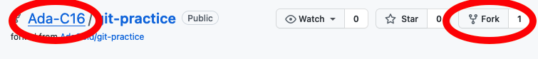
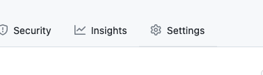
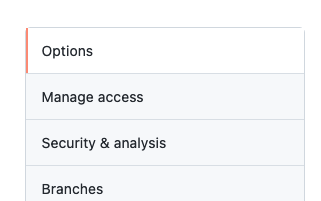
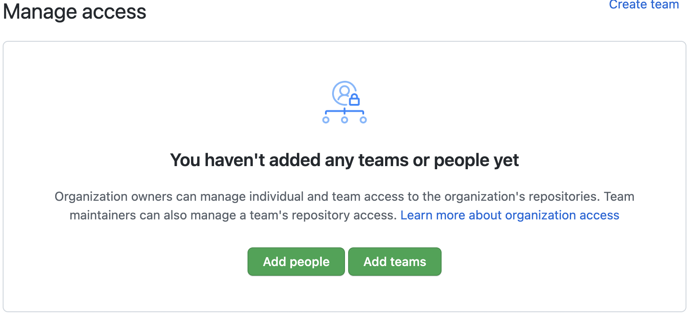
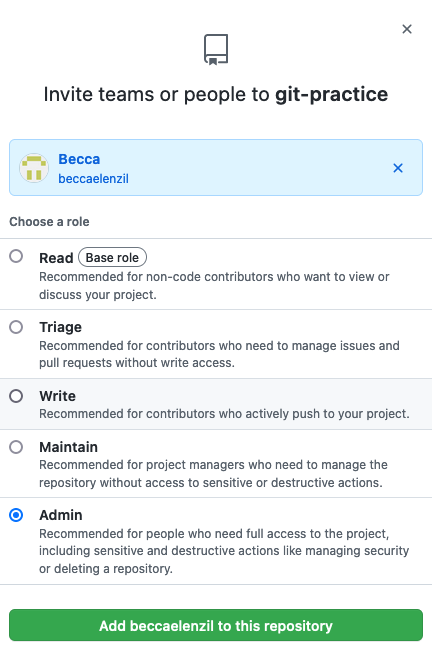
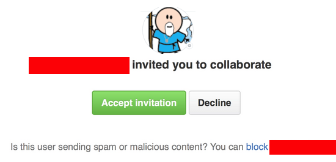
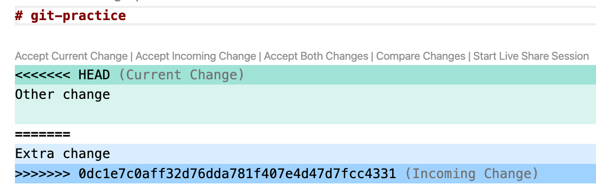

# Activity: Using Git to Collaborate

## Goal

Previously we examined how you can use git to save our work progress by making commits saving changes to our code. This has allowed us to back up our work in incremental changes both locally and on GitHub. Now we will use git and GitHub to collaborate remotely.

## Things to Remember

- **Communicate** as a team on Zoom, ask each other for help
  - Remember you can share your screen to get help or demonstrate for your teammates.
- Ask for help via Slack, if needed, so your instructor can know to jump in and assist

## Before Getting Started

Just to make sure that VS Code is set as the default editor for git commit messages, execute this command in the terminal:

```bash
$ git config --global core.editor "code --wait"
```

### Set Up the Repository

We will form into teams of 2-3 students. **One** partner will fork and clone this repository.

1. To fork the repository, verify that you are on the **Ada-CXX** repository (where XX is your cohort number), and click on the **Fork** button.



2. Then go to the **Settings** and **Collaborators & teams**.





3. Add your teammates as collaborators





4. Each team member will get an email inviting them to the repository. They should click on the accept link.



### Clone the Repository

Each team member should clone the repository to their local computer using:

```
$ git clone <URL>
```

Make sure you are cloning your **partner's** repository and **not** Ada's.

If you `cd` into the repository and type `git remote -v` you should see your partner's repo and **NOT** Ada-CXX.

## Activity Instructions

### Step 1: Complete a Function

Each team member, A, B, and (maybe) C will complete **one** of the following functions and then add and commit the file.

So one teammate will fill in the body of the function in `function_a.py` and another will complete the body of the function in `function_b.py`, etc.

**function_a.py**

```python
def most_common_value(number_list):
    """ returns the most common element of the list
    """
    frequency_index = {}
    max_frequency = -1
    most_common_value = None
    for num in number_list:
        if frequency_index.get(num):
            frequency_index[num] += 1
        else:
            frequency_index[num] = 1

        if max_frequency < frequency_index[num]:
            max_frequency = frequency_index[num]
            most_common_value = num

    return most_common_value
```

**function_b.py**

```python
def silly_sum():
    """ reads numbers from the user
        summing as we go until either
        the user enters 0, or
        the sum reaches or exceeds 1000
    """
    num = int(input('Please enter a number => '))
    sum = 0

    while num != 0:
        sum += num
        if sum >= 1000:
            break

        num = int(input('Please enter a number => '))

    return sum
```

**function_c.py** - for 3-person teams

```python
def merge_lists(list_a, list_b):
    """ Returns a new list which is
        a combination of list_a and list_b
        without any duplicate elements.
    """
    return list(set(list_a) | set(list_b))
```

### Step 2: Add and Commit Your Function

Each team member should should add and commit their work.

```
$ git add <filename>
$ git commit -m "<COMMIT MESSAGE>"
```

This stages changes and saves the changes as a commit. Use meaningful commit messages.

### Step 3: Push Changes to GitHub

Each team member should try to send their changes to GitHub.

```
$ git push
```

**🚨 Oh Snap! 🚨** One or more team members should get this message!

```
$ git push
To github.com:<GIT-USERNAME>/git-practice.git
 ! [rejected]        main -> main (fetch first)
error: failed to push some refs to 'github.com:<GIT-USERNAME>/git-practice.git'<GIT-USERNAME>
hint: Updates were rejected because the remote contains work that you do
hint: not have locally. This is usually caused by another repository pushing
hint: to the same ref. You may want to first integrate the remote changes
hint: (e.g., 'git pull ...') before pushing again.
hint: See the 'Note about fast-forwards' in 'git push --help' for details.
```

This is because GitHub has commits not available locally. One partner managed to push their commits before the other(s).

GitHub will not let the rest of the team push changes until they have merged their git history with what is already on GitHub.

### Step 4: Team Members Unable to Push Should Pull

Each team member who was unable to push to GitHub should instead **pull** the changes which are on GitHub, but not available locally.

_Notice we are following the directions git provided above._

```
$ git pull
```

The git command should open an editor with a default merge message. Close the editor window that it opened, and the command will complete.

>`git pull` is doing two things. First it retrieves information about what commits are in the remote repository. Then it tries to merge those changes into the local repository. If we had pulled before committing, git would have been able to bring down the changes directly without additional intervention on our part. However, since we all committed before trying to pull, git needs to do some bookkeeping. It records a local merge commit message, but allows us to edit the message ourselves if we would like!

After pulling changes from GitHub verify that the local repository matches GitHub. Then each remaining teammate should push their changes to GitHub.

```
$ git push
```

Groups of 3 will have one teammate repeat this step until everyone's function is on GitHub.

### Step 5: Working on the Same Function

What if multiple people write code on the same area of the same file?

Each team member should complete the function in `function_d.py`. Each team member should write their own solution.

Then add, commit, and push changes to GitHub using the same steps as above. Remember to `git pull` if an error is encountered while pushing.

At least one team member should get the following message.

```
$ git pull
 * branch            main       -> FETCH_HEAD
Auto-merging README.md
CONFLICT (content): Merge conflict in function_d.py
Automatic merge failed; fix conflicts and then commit the result.
```

This message occurs when git does not understand how to combine the changes. This situation is called a **merge conflict**. When you look at the code in VS Code it should look something like this.



### Step 6: Using Zoom Screen Sharing, Resolve the Conflict

To resolve this merge conflict either click on the links in VS Code to accept the current or incoming change, or edit the code to combine the changes manually.

Notice that git really does add the lines beginning with `<<<<<<<`, `=======`, and `>>>>>>>` into the file when a merge conflict occurs. If you use the VS Code links to resolve the conflict they will automatically be removed. But if you resolve the changes manually, be sure to remove those lines from the file yourself.

After resolving the merge conflict, test the function by running the file before moving on.

```
python function_d.py
```

### Step 7: Add and Commit the Resolution to the Merge Conflict

The team member who resolved the conflict can then add and commit the file and push the changes to GitHub.

### Step 8: Everyone Pull the Current Remote Repository

Lastly every team member should run `git pull` to retrieve the remote repository to their computer and verify that they have the same code on their computer.

## Questions to Answer

- How do git and GitHub allow us to collaborate on a project?
- What is a _merge conflict_?
